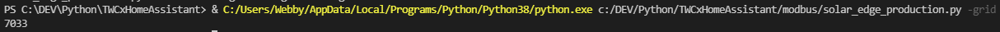

# Introduction
Ce rapport regroupe les démarche suivi anisi que les problèmes rencontrés l'hors du developpement du projet.

## Analye du code existant

Il manque beacoup dans le documentation du projet. Heuresement il y a pas mal de commentaires dans le code.

On peut voir dans le index.php qu'on utilise un protocole nommé IPC qui veux dire Inter process communication.
```php
// Initialize Interprocess Communication message queue for sending commands to
// TWCManager.py script and getting data back.  See notes in TWCManager.py for
// how IPC works.
$ipcKey = ftok($twcScriptDir, "T");
$ipcQueue = msg_get_queue($ipcKey, 0666);
```

Ce IPC est utilisé pour envoyer des commandes au program python qui tourne en boucle en attente de commandes. Ces commandes sont traité et passé a travers le rs485 pour controller le chargeur Tesla.

Il faut que je trouve exacement les commandes qui active le track green energy.

En même temps, la façon don't j'allais chercher la production de l'installation PV n'est plus possible. Jusqu'a maintenant, HomeAssistant utilisait un protocol appelé ModBus qui va intéroger l'onduleur.

Je vais ecrire un program python qui va faire tout cela et rendre le programme accessible depuis la ligne de commande.
Cette solution est beacoup mieux car elle evite le cas ou HomeAssistant crash/est down.
A partir de la, je pourrais regarder si je peut appeler cette commande depuis le backend et puis mettre a jour le front end.

Il y a une librarie qui es fait pour modbus

```
pip install solaredge_modbus
```

Je me souvien pas de l'ip de l'onduleur donc j'ai passé 2 heures a faire des manipulations. Il y a une application android qui permet de configurer l'onduleur. Elle ne permet pas d'afficher l'ip donc j'ai du aller sur le routeur voir les appareils connecté et trouver l'adresse mac qui a un constructeur SolarEdge. Ducoup c'est l'ip 192.168.0.26. J'ai dit au routeur de lui la reserver afin qu'elle ne change plus.

Maintenant je devrais pouvoir me connecter sur le modbus a l'aide de la librairie.


Comme on peut le voir, modbus ne répond pas. C'est possible que la librairie ne soit plus a jour.

Je suis aller regarder le github de la librairie et je ne suis pas le seul. On dirais que solaredge a release un firmware env le 10 janvier 2022 qui désactive modbus a traver le wifi.


Donc je dois tirer un cable pour être sur que c'est ça. Je sais pas si l'onduleur qu'on a supporte ethernet. A premiere vu non, j'ai pas trouvé de port ethernet.

Il y en a un. Il faut arreter l'onduleur, l'ouvrir et le port est caché a l'interieur. Je ne peut pas faire ça sans mon pere car je risque de casser quelque chose ou même de me tuer.

# Solaredge modbus

On a tiré un cable durant ces derniers jour. J'ai configuré notre routeur pour qu'il met l'ip 192.168.0.27 a l'onduleur. Je peut maintenant me connecter sur l'onduleur.


J'ai passé du temps a lire la doc. J'ai vu que dans le read_all de l'onduleur il manquait l'exportation (l'énergie qui pars dans le réssau publique). Donc en lissant la doc j'ai vu que cette valeur est mersuré avec un capteur externe. Il faut intéroger ce capteur séparément pour avoir la valeur.

Voila le code que j'ai concu:

```python
if __name__ == "__main__":
    import solaredge_modbus as smdb
    from settings import solar_edge_ip, solar_edge_port
    import argparse
    
    parser = argparse.ArgumentParser(description=f"Uses modbus TCP to interogate the solar edge inverter on ip {solar_edge_ip}:{solar_edge_port}")
    parser.add_argument('-grid',action="store_true",  help='returns the grid power')
    parser.add_argument('-solar',action="store_true",  help='returns the solar power')
    parser.add_argument('-house',action="store_true",  help='returns the house\'s consumption')
    
    args = parser.parse_args()
    if(not args.solar and not args.grid and not args.house):
        print("Missing one argument -grid or -solar or -house\nUse -h for help")
        exit(-1)
    
    inv = smdb.Inverter(host=solar_edge_ip,port=solar_edge_port)
    
    if(inv.connect()):
        meter = inv.meters()["Meter1"]
        
        solarPower = inv.read("power_ac")["power_ac"]
        gridPower = meter.read("power")["power"]
        housePower = solarPower - gridPower
        
        inv.disconnect()
        meter.disconnect()
        
        #print(f"Solar: {solarPower / 1000} kWh\tGrid: {gridPower / 1000} kWh\tHouse: {housePower / 1000} kWh")
        
        if(args.solar):
            print(solarPower)
        elif(args.grid):
            print(gridPower)
        elif(args.house):
            print(housePower)
        exit(0)
    else:
        print("Inverter unreachable")
        inv.disconnect()
        exit(-1)
```

Ce code prend en argument -grid, -solar ou -house.

Voici un résultat:



Ici on appelle avec -grid et on reçois 7033 Watts. Donc a ce moment, l'installation exporte 7kWh au réssau publique.

Je vais implémenter ce script en tant que commande système sur le raspberry.

## Installation sur le raspberry

On doit d'abord installer le script et le faire marcher

```
cd /etc
mkdir solarEdgeModbus
cd solarEdgeModbus
touch solar_edge_production.py
touch settings.py
chmod +x solar_edge_production.py
chmod +x settings.py
nano solar_edge_production.py
nano settings.py
```

durant les 2 nano, copier les scripts

maintenant, on peut tester le script:


Il nous manque solaredge_modbus

```
pip3 install solaredge_modbus
```

et puis:


ça marche!

il nous faut maintenant creer un lien pour l'os


Cette erreur arrive car l'os ne sait pas comment lancer le script (python dans notre cas) donc il nous faut ajouter ceci en haut du script ```solar_edge_production.py```:

```
#!/usr/bin/python3
```

et puis


Je remarque que l'execution est assez lente. C'est probablement juste le fait que le pi n'est pas puissant et que python est un langage assez lourd.

## Inegration dans le script controleur

Pour le moment, le script qui régle le tôt de charge de la tesla ne prend pas en compte notre production d'énergie. Mais le dev qui l'as ecrit a implémenté ce qu'il faut pour le faire. Voila le code que je doit modifier:

```Python
def check_green_energy():
    global debugLevel, maxAmpsToDivideAmongSlaves, greenEnergyAmpsOffset, \
           minAmpsPerTWC, backgroundTasksLock

    greenEnergyData = run_process('curl -s -m 60 "http://192.168.13.58/history/export.csv?T=1&D=0&M=1&C=1"')

    m = re.search(b'^Solar,[^,]+,-?([^, ]+),', greenEnergyData, re.MULTILINE)
    if(m):
        solarW = int(float(m.group(1)) * 1000)
        backgroundTasksLock.acquire()
        # Watts = Volts * Amps
        # Car charges at 240 volts in North America so we figure
        # out how many amps * 240 = solarW and limit the car to
        # that many amps.
        maxAmpsToDivideAmongSlaves = (solarW / 240) + \
                                      greenEnergyAmpsOffset

        if(debugLevel >= 1):
            print("%s: Solar generating %dW so limit car charging to:\n" \
                 "          %.2fA + %.2fA = %.2fA.  Charge when above %.0fA (minAmpsPerTWC)." % \
                 (time_now(), solarW, (solarW / 240),
                 greenEnergyAmpsOffset, maxAmpsToDivideAmongSlaves,
                 minAmpsPerTWC))

        backgroundTasksLock.release()
    else:
        print(time_now() +
            " ERROR: Can't determine current solar generation from:\n" +
            str(greenEnergyData))


```

Ici nous voulons faire en sorte que le script va utiliser la commande accessible par le système pour aller intéroger l'onduleur.
Je supose qu'il manque du code. On peut voir que ici que la production entiere solaire. Hors, chez nous, il y a la maison qui est aussi connecté a l'installation PV. En gros, la, on ne prend pas en compte qu'il y a eventuellement le chauffage en marche et on va donc overshoot. Mais, il faut tester et on verra bien.

Déjà, il nous faut pas faire de regex ou autre mais un try catch. Si par exemple l'onduleur ne répond pas, il y aura une value error car on ne recois pas un int.

```Py
solarW = int(subprocess.check_output(['solaredge','-grid']).decode("utf-8")[0:-1])
```

En testant, les log me dissent qu'il y a 45 Ampere a disposition alors qu'on produit seulment 6Kw. ça m'as l'air faut (beacoup trop) mais il faudrait tester. Malheuresement, mon père a pris la tesla donc je devrais tester ce weekend.

## Resultat des tests

Le problème d'offset est belle est bien présent. Le code ne prend pas en compte la consomation de la tesla.

### Solution possible: 
  1. Aller lire la consomation de la tesla sur un shelly a traver le réssau (c'est un capteur de courant)
  2. Trouver une équation qui transforme des ampere en KW (Il faut l'information des ampere tiré par la tesla)

Je vais essayer la solution 2 si possible. Car les shelly peuvent avoir des problèeme et ça va rajouter un composant qui peut sauter et mettre le système hors service.

Il me semble aussi que la convertion qui ce trouve dans le code si dessus est fausse car c'est des valeurs américaine alors que chez nous on a un a des autres valeur donc le Watt/240v = ampere est faut et je doit trouver la bonne constante pour la convertion.

## Implémentation de la solution

D'abord je doit trouver la bonne valeur pour transofmer des watt en ampere. Pour le faire je met la testla en charge et je regarde les valeur:
Puissance: 7000Watt
Courant: 10 Ampere

Pour trouver la puissance c'est 
```
P = A * V
```
Donc pour trouver V
```
V = P / A = 7000 / 10 = 690V
```

Donc si la tesla tire 11 Ampere par exemple on aura:
```
P = 11A * 690V = 7590W
```

Et en testant, ça a l'air de bien coller ensemble.

En réfléchissant de ou sort ces 690V c'est trés clair en faite. La tesla est branché sur du 3 phase 230V donc 230V * 3 = 690V

Il me manque un moyen pour trouver le courant tiré par la tesla mais je sais que cette valeur est accessible dans le code car le frontend l'affiche.

Il y a une focntion qui le fait :

```py
total_amps_actual_all_twcs()
```

Elle va envoyer un request sur le rs485 a la borne de charge qui va répondre.

Voila le code de la fonction final:


```py
def check_green_energy():
    global debugLevel, maxAmpsToDivideAmongSlaves, greenEnergyAmpsOffset, \
           minAmpsPerTWC, backgroundTasksLock
    try:
        #Grid is the total power exported if > 0 and imported if < 0
        #When the tesla is charging, grid will include the power going to
        #the tesla, so we need to remove that offset so we get the exact
        #Overhead of green energy
        grid = int(subprocess.check_output(['solaredge','-grid']).decode("utf-8")[0:-1])
        
        offset = total_amps_actual_all_twcs() * 690
        solarW = grid + offset
        
        backgroundTasksLock.acquire()

        maxAmpsToDivideAmongSlaves = (solarW / 690) + \
                                      greenEnergyAmpsOffset

        if(debugLevel >= 1):
            print("%s: Solar generating %dW so limit car charging to:\n" \
                 "          %.2fA + %.2fA = %.2fA.  Charge when above %.0fA (minAmpsPerTWC)." % \
                 (time_now(), solarW, (solarW / 690),
                 greenEnergyAmpsOffset, maxAmpsToDivideAmongSlaves,
                 minAmpsPerTWC))

        backgroundTasksLock.release()
    except:
        print(" ERROR: Can't reach inverter:\n")

```

Et les tests on l'air prométeur. Malheureusement la tesla est deja a 90% chargé ce matin donc je peut pas tester correctement mais ça avait l'air parfait.

## Le frontend

Pour le frontend, j'ai déssiné une maquette rapidement et j'ai fait une page HTML avec ce qui va ou. Je veux afficher le courant a disposition anisi que le courant qui est tiré, mais cette information est dans le script python qui est accessible a travers le inter process communication.

Donc il faut faire une espece de API qui pourra être utilisé pour faire du polling anisi que de mettre le mode boost ou eco.

Pour le changement de mode, je vais aller mettre un echo de debug dans la fonction qui est appelé et je pourrais alors voir quelle commande mettent le boost et les quelle mettent en mode eco.

Voila pour le mode boost:

```php
ipcCommand("setNonScheduledAmps=-1");
ipcCommand("setScheduledAmps=16 startTime=21:00 endTime=07:00 days=127");
ipcCommand("setResumeTrackGreenEnergyTime=-1:00");
ipcCommand("chargeNow");
```

Voila pour le mode eco:

```php
ipcCommand("setNonScheduledAmps=-1");
ipcCommand("setScheduledAmps=16 startTime=21:00 endTime=07:00 days=127");
ipcCommand("setResumeTrackGreenEnergyTime=-1:00");
ipcCommand("chargeNowCancel");
```

Avec ses commandes, pendant le nuit, de 21:00 - 07:00 le chargement sera a 16A (donc a fond) et le reste soit mode boost donc 16A ou alors on suis la prodcution énergétique.
J'ai copié les fonctions et l'init du ipc dans un nouveau fichier php. Cette page fera 2 choses. Soit mettre boost ou eco, soit afficher les information instantané du script.
Donc un IPCquery.
Pour le query sur le process, j'ai ce code de départ:

```php
$response = ipcQuery('getStatus');
if($debugLevel >= 1) {
    print("Got response: '$response'<p>");
}

if($response != '') {
    $status = explode('`', $response);
    $statusIdx = 0;
    $maxAmpsToDivideAmongSlaves = $status[$statusIdx++];
    $wiringMaxAmpsAllTWCs = $status[$statusIdx++];
    $minAmpsPerTWC = $status[$statusIdx++];
    $chargeNowAmps = $status[$statusIdx++];
    $GLOBALS['nonScheduledAmpsMax'] = $status[$statusIdx++];
    $GLOBALS['scheduledAmpsMax'] = $status[$statusIdx++];
    $GLOBALS['scheduledAmpStartTime'] = $status[$statusIdx++];
    $GLOBALS['scheduledAmpsEndTime'] = $status[$statusIdx++];
    $scheduledAmpsDaysBitmap = $status[$statusIdx++];
    for($i = 0; $i < 7; $i++) {
        if($scheduledAmpsDaysBitmap & (1 << $i)) {
            $GLOBALS["scheduledAmpsDay[$i]"] = 1;
        }
    }
}
```

Je n'aime pas l'idée d'avoir ces valeur en vagabond dans des variables donc j'ai modifié le tout pour faire un tableau php ou on aurait par exemple:

```php
$arrayStatus["wiringMaxAmpsAllTWCs"] = 16
```

En plus d'avoir tout au même endroit, il est possible d'utiliser le json_encode pour rendre le tout accessible a travers js.

Pour le js, je fais une routine qui va appeler l'api et mettre a jour le contenu dans le HTML direcement.

Voila pour le js:

```js
$(function(){
    updatePage();
    setInterval(updatePage, 2000);

     $('#btnBoost').click(function() {
        window.location.href='/TWCapi.php?Boost=1';
     });

     $('#btnEco').click(function() {
        window.location.href='/TWCapi.php?CancelBoost=1';
     });
});

function updatePage(){
    $.getJSON( "TWCapi.php?GetStatus=1", function( data,status ) {
        if(status == "success"){
            if(data.chargeNowAmps > 0){
                $("#mode").text("Mode BOOST");
                $("#btnEco").removeClass('hidden');
                $("#btnBoost").addClass('hidden');
            }else{
                $("#mode").text("Mode ECO");
                $("#btnEco").addClass('hidden');
                $("#btnBoost").removeClass('hidden');
            }
        }

        $("#available").text(data.maxAmpsToDivideAmongSlaves + " A");
        $("#pulling").text(data.TWC[0].twcChargeSpeed + " A");
    });
}
```

J'ai voulu utiliser JQuery car je connais la librairie assez bien.

Voilà le frontend fini:


Les valeur current available anisi que le pulling sont misses a jour toutes les 2 secondes.

# Resultat


# Installation

J'ai écrit le guide d'installation dans le fichier README.md en anglais du repo git a fin que d'autre personne puissent reprendre mon travail s'il le souhaite.

J'ai rencontré beacoup de problème pour le faire au propre.
Premierement, quand l'os démarre, on peut ajouter des commandes dans le /etc/rc.local. Mais ce fichier est executé en tant que root. Ce qui fait que tout marchais si je lancais les commandes a la main mais quand je rebootais, les screens n'etais pas lancés, les logfile pas existant ou au mauvais entroid etc.

Pour palier a ce problème il faut utiliser:

```
su pi -c "<command>"
```

Mais dans ce cas, les fichiers de logs ou autre fichier de config ne seront pas dans les bons dossiers.
Donc il faut ajouter un cd avent de lancer la commande donc on aurait:

```
cd /home/pi/TWCManager/TWC
su pi -c "screen -m -d -L -Logfile TWCManager.log -S TWCManager python3 /home/pi/TWCManager/TWC/TWCManager.py"
cd -
```

# Conclusion

On a un projet qui tourne sur un raspberry connecté par rs485 a une borne tesla. Sur le raspberry tourne un script python qui va être le master du systène et controller la borne. En même temps, le script va périodiquement lancer un autre script qui va retrouner la production solaire. Avec la productin solaire, le script calcule le "overhead" de la producion et va informer la borne tesla du courant qu'elle peut tirer.

En parralèlle, une page web est mise a disposition pour afficher les informations du système. Cette page a aussi un boutton qui permet de override le courrant a disposition et le mettre au max (16ampere).

Le système est résistant au coupure de réssau, au coupure de l'alimentation (reboot) et consome pas plus de 5 watts.

Les problèmes rencontrés sont:
 * Droit d'accées au fichiers
 * Execution par root au lieu de pi
 * Manque de logfiles pour le debug

Le projet rempli le cahier des charges du projet en plus d'être mis a disposition sur github avec guide d'installation.

