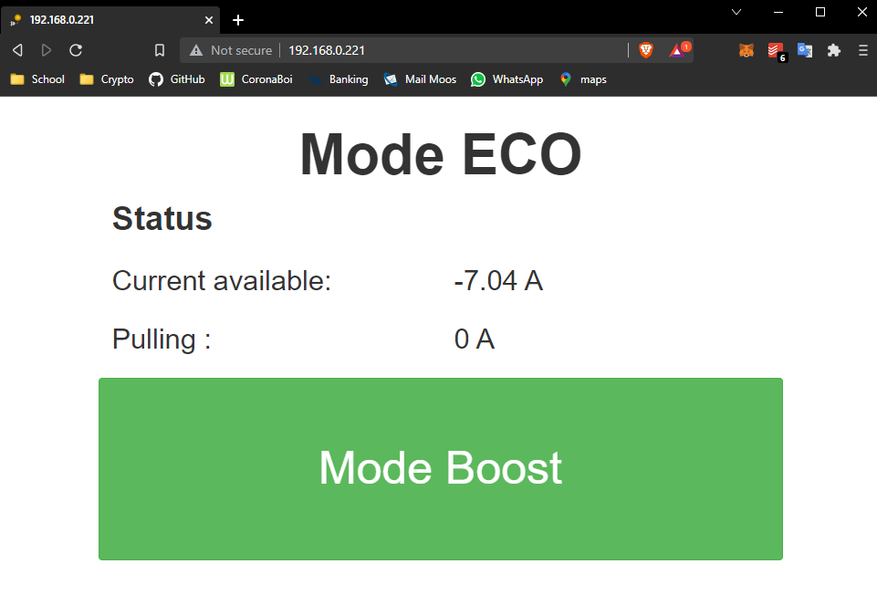

# TWCManager
TWCManager lets you control the amount of power delivered by a Generation 2 Tesla Wall Connector (TWC) to the car it's charging.  This can save around 6kWh per month when used to track a local green energy source like solar panels on your roof.  It can also avoid drawing grid energy for those without net metering or limit charging to times of day when prices are cheapest.

Due to hardware limitations, TWCManager will not work with Tesla's older High Power Wall Connectors (HPWCs) that were discontinued around April 2016.  TWCManager will also not work with Generation 3 TWCs released around Jan 15th 2020.  Sadly, gen 2 TWCs are no longer sold by Tesla and may become hard to acquire over time.  We don't expect to add support for gen 3 TWCs unless their wireless protocol is reverse engineered by a third party.

# Tracking solar edge
To track green energy with a solaredge inverter, it would be possible to go through the solaredge api but that would not allow for high polling rate as the api calls are limited.

Instead, it is possible to use a protocol called modbus. To activate modbus follow this [link](https://www.solaredge.com/sites/default/files/sunspec-implementation-technical-note.pdf)

The inverter needs to be connected through an ethernet cable (a firmware update disabled modbus over WiFi)

# Installation
For the RS485 connection, follow the pdf installation guide until Install TWCManager.

First step is to install some packages:

```
sudo apt-get install -y screen
sudo apt-get install -y git
sudo apt-get install python3-pip
git clone https://github.com/LennyBo/TWCManager.git
cd TWCManager
sudo pip3 install -r requirements.txt
sudo nano TWC/TWCManager.py
```

Here, change wiringMaxMapsAllTWCs and wiringMaxAmpsPerTWC to suit your installation.
Make sure you go thourgh all the settings in the TWC/TWCManager.py file and understand what you are doing.

Next step is to start the script on boot in case of power outages. I assume that you cloned inside /home/pi
If that is not the case, make sure to change the commands accordingly.

Open /etc/rc.local and add this command before the exit 0

```
cd /home/pi/TWCManager/TWC
su pi -c "screen -m -d -L -Logfile TWCManager.log -S TWCManager python3 /home/pi/TWCManager/TWC/TWCManager.py"
cd -
```

These commands will make sure the script is running on boot, on a detached screen, logging to TWC/TWCManager.log and with the user pi.

Now we also have to make that script execuable and reboot to test

```
chmod +x TWC/launch.sh
sudo reboot
```

If everything went well, you should see a screen with the TWCManager running inside it using this command:
```
screen -r TWCManager
```
(to detach from the screen, type ctrl+a d)

If something is wrong, you should have a log file called TWC/TWCManager.log

# Installing the webserver

```
sudo apt-get install -y lighttpd
sudo apt-get install -y php7.0-cgi
sudo lighty-enable-mod fastcgi-php
sudo service lighttpd force-reload
sudo chown -R www-data:www-data /var/www/html
sudo chmod -R 775 /var/www/html
sudo usermod -a -G www-data pi
cp ~/TWCManager/HTML/* /var/www/html/
sudo reboot
```

Now the webinterface should be accessible through http://<your_ip_address>/


